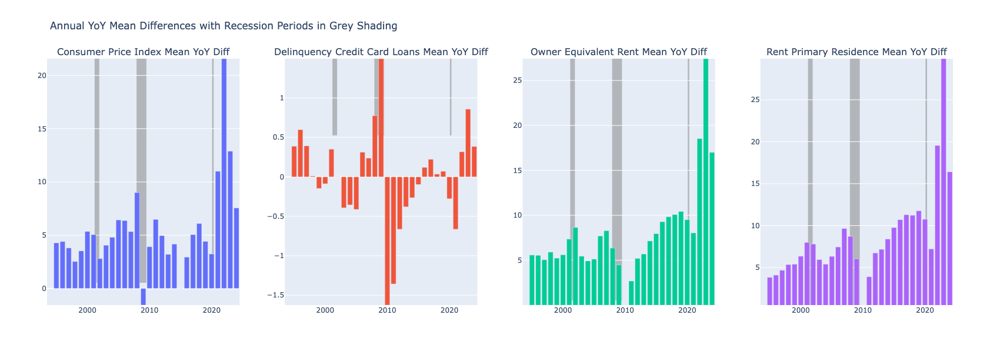
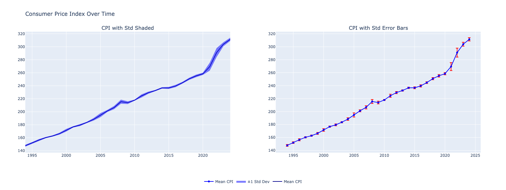
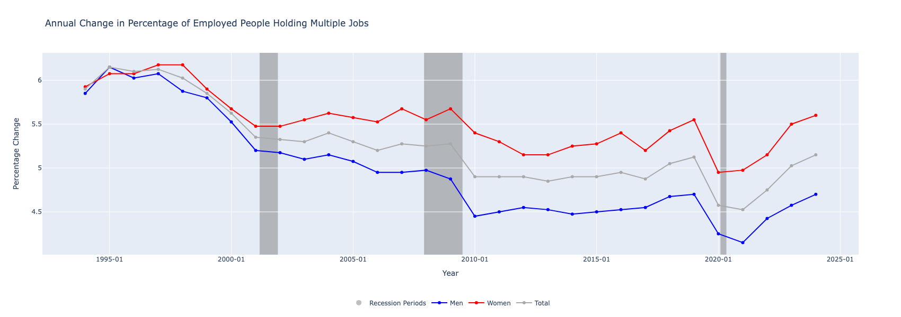
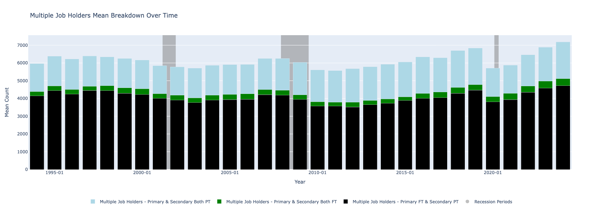
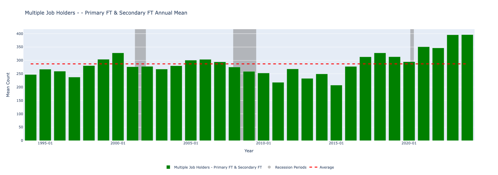
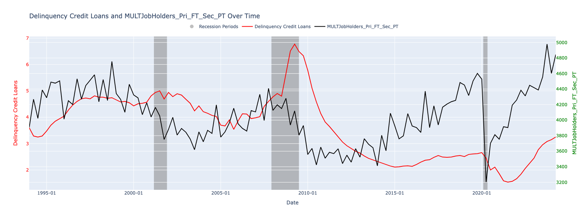
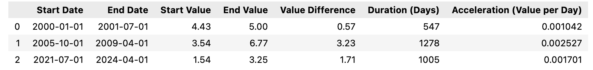
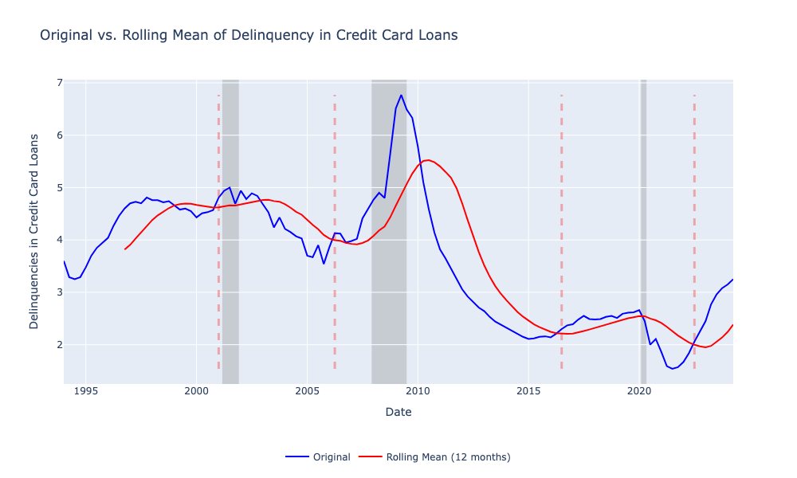

## $${\color{red}Economic \ impacts \ that \ influence \ Multiple \ Job\ Holder \ Data \ ? \}$$

## Project Overview
> The labor market is constantly evolving, with increasing numbers of individuals taking on multiple jobs. This phenomenon raises questions about the economic and social implications of such arrangements. This notebook analyzes data related to multiple job holders, shedding light on trends, demographics, and the overall impact on the workforce.

## Data Sources
Analysis was conducted on Sept 2024 and all files were as of July 2024. 
>- **U..S Fred Data:** CPI, CPI Primary Rent & Owner Equivalent, Credit Card Delinquency Rates, Fed Fund Effective Rate, and Different Types of Multiple Job Holders. 

## Tools and Libraries Used

>- Python 3.x
>- **Pandas:** For data manipulation and preprocessing.
>- **NumPy:** For numerical computations.
>- **Matplotlib / Plotly:** For data visualization and trend analysis.

## Steps: 
### **A. Data Preparation:**
**Data Cleaning & Merging:**
- All files were inner merged with the 'DATE' column and combined with a start date of January 1, 1994.
- The datatypes were kept the same because they provide valuable insights in their format. For example, changing the floats to integers would change the results.
- There were no nulls found which is expected as this is usually a data source with clean data.

**The Following recession periods were added to certain chart figures to understand how the metrics moved during those cycle periods.** 
```
recession_periods = [
    {'start': '2001-03-01', 'end': '2001-11-30'},
    {'start': '2007-12-01', 'end': '2009-06-30'},
    {'start': '2020-02-01', 'end': '2020-04-30'}
]
```

### **B. Series of Analysis & Visualizations:**
#### 1. **Year-Over-Year Statistical Summary**
- Initially, I examined the overall statistics for the entire dataset, which provided a summary across all years. However, the large variations over time made it difficult to gain meaningful insights from the combined data. To better understand the trends and fluctuations, I decided to analyze the statistics yearly, allowing for a clearer view of how these values changed over time.
  
#### 2. **Annual Mean Differences with Recessions Periods Highlighted**
- After reviewing the annual statistics table that displayed the variable means for each year, I noticed significant year-over-year fluctuations in the mean differences in recent years. As a result, these charts were created to visualize the annual percentage changes.
  


**Consumer Price Index Mean YOY Diff**
- It appears interesting that CPI increased YoY before every recession. The only recession that did not include CPI increases was the 2020 recession induced by the sudden COVID crisis. 
- CPI had a drastic increase YoY from 2020-2022 probably due to Federal Reverse monetary policy. However, since then, there has been a continuous YoY decrease in CPI. 

**Delinquency Credit Card Loans Mean YoY Diff**
- Delinquencies in Credit Cards increased before and during the recession periods of 2000 and 2008. However, similar to the CPI trend, the 2020 Covid-induced recession did not have a YoY increase before it. 

**Owner Equivalent Rent Mean YoY Diff**
- The Owner Equivalent Rent trend appears different compared to CPI, Credit Card Delinquencies, and Rent Primary Residences. Specifically, OER experienced a consistent year-over-year increase from 1999 to 2002, even amid the 2001 recession, before entering a downward trend post-recession. 
- In contrast, during the 2008 financial crisis, OER showed a decline leading up to the recession, which continued afterward. More recently, during the COVID-19 recession, there was a brief one-year downtrend, followed by a dramatic upswing from 2022 to 2023


#### 3. **Stability & Volatility Periods (Standard Deviation & Error Bars)**

When the mean is stable with small error bars, suggests more predictability as every following quarter is not too different from the previous. On the other end, the periods with wide error bars suggest low confidence that the mean represents the rest of the dataset. 
- CPI error bars expanding before recession periods (e.g., 2001, 2007) and after 2020. This makes sense as these periods included sudden spikes quarter over quarter. 
- It is interesting to observe the error bars during those recession periods and how for each consequently recession the volatility expands with larger fluctuations than the prior recession. I wonder if this is due to the increase in value or the increase in volatility over time.

#### 4. **Percentage of Employed People Holding Multiple Jobs**
  


- From 1995 to 2010, the percentage of multiple jobholders showed a clear downward trend. Following that period, it stabilized within a range, dipping sharply to a historic low during the pandemic shutdowns. However, there has been a resurgence since then, approaching the 2008 highs.

- Notably, a downward trend in multiple jobholders preceded both recessions, raising questions about whether this was due to fewer job openings or a choice among multiple job holders.

- Additionally, since 1997, a higher percentage of women have held multiple jobs compared to men. This raises intriguing questions about the economic factors at play. Are women not earning enough in their primary full-time positions, or are they pursuing financial goals?

#### 5. **Types of Multiple Jobs Holders Mean Breakdown Overtime**



- Of the three types of multiple job holders, Primary Full-Time with a Secondary Part-Time job is the most common type.
- All Multiple Job Holder Types have been trending higher compared to the average of the last 30 years.
  


- However, the group with individuals with Primary & Secondary Full-Time jobs started to increase in 2021 before the two other groups.
  
#### 6. **Delinquency in Credit Card and Multiple Job Holders (Primary FT & Secondary PT)**



- In the periods leading up to the 2001 and 2008 recessions, the trend in multiple job holders with a primary full-time and secondary part-time role closely followed the delinquency rate. 
- As shown in the chart, this group of job holders increased each time it touched the delinquency rate (e.g. 1996-01 to 2000-01 & 2005-01 to 2008-01). However, this pattern shifts once the recessions begin, likely due to fewer job opportunities available during those economic downturns.

#### 7. **Credit Card Delinquency Acceleration Rate Comparison**

- The period from October 2005 to April 2009, which began before the 2008 Financial Crisis, exhibits a substantial value increase of 3.23 over 1,278 days, resulting in an acceleration of approximately 0.0025 per day.

- In contrast, the current period (July 2021 to April 2024) shows a smaller value increase of 1.71 over 1,005 days, yielding an acceleration rate of about 0.0017 per day. However, with historically low unemployment at present, could the acceleration rate increase if the unemployment trend reverses and begins to rise?

#### 8. **Top Strong Correlation Analysis**

- Employment-related metrics also demonstrated substantial correlations with inflation and housing costs. The proportion of **Male Multiple Job Holders** relative to total employment had a robust correlation with CPI (0.82), suggesting that higher inflation may be associated with increased labor market participation in secondary jobs. The strong correlations between both **Owner Equivalent Rent** (0.80) and **Rent of Primary Residence** (0.79), indicate a potential feedback loop between inflation, housing affordability, and labor force adjustments.

#### 9. **12-Month Mean of Delinquency as a Recession Signals**

- We can observe that when the Original value of Delinquency in Credit Card Loans across above its rolling 12-month mean it signals a recession a couple of months later except in April 2022 as no recession has been called out as of yet.

### **C. Conclusion & Next Step:**
The analysis revealed a notable correlation between economic and rent-related metrics and the prevalence of multiple jobholders among males, a trend not observed in females. The correlations are as follows:

- **Consumer Price Index and Male Multiple Jobholders Percentage:** 0.824790
- **Owner Equivalent Rent and Male Multiple Jobholders Percentage:** 0.802205
- **Rent for Primary Residence and Male Multiple Jobholders Percentage:** 0.799774

These findings suggest that economic factors may influence the likelihood of men taking on multiple jobs more significantly than women.

#### Next Steps
Moving forward, I plan to revisit this analysis in a few weeks to incorporate updated metrics. In particular, I aim to enhance the study by adding additional economic indicators, including wage fluctuations, job openings, poverty trends over time, daycare costs, and retail prices. This broader dataset will provide a more comprehensive understanding of the factors influencing multiple job holding.

